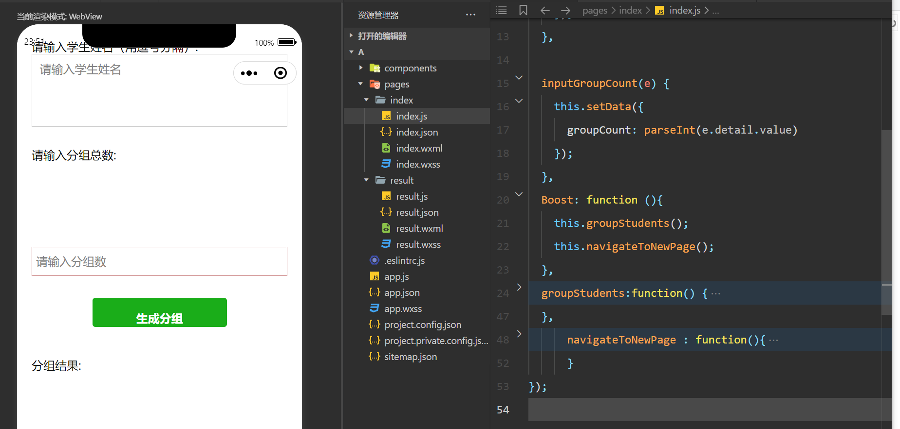

# 8.21日报

## 今天做了什么

今天没有着手于美化ui，而是想完善小程序的功能，学习了一些函数然后用进去，但结果不是很理想

## 今天的收获

我觉得吧，虽然今天的成果不是很理想，但我认为去探索的过程是很有意义的，结果反而是其次，因为这个程序，这门课一过就过了，但探索的过程能给我今后学习提供很多经验

## 今天解决的问题

应该是弄懂了小程序跳转页面的一些操作吧，虽然不知道为什么在自己的程序里跑不起来

## 没有解决的问题

那必定还是今天的页面跳转问题，如果明天还是无果的话就考虑换个思路吧

好像附图在GitHub看不见？

​          