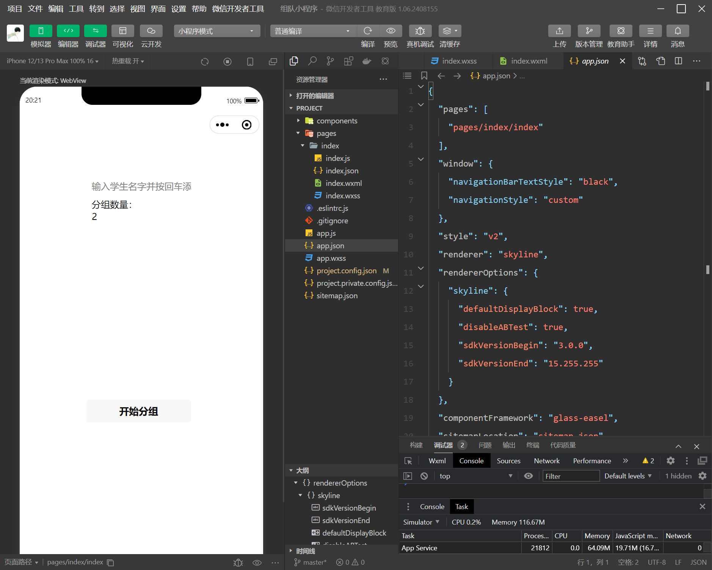

# 8.20日报

## part 0

sorry，昨天因为没有及时看到作业要求，用了word没有用markdown，今天走回正道用md

## 今天做了什么

关于今天做了什么，首先是白天的时间，首先是学习一些js，在网上找些视频，了解了一些基础基础的语法，然后再用微信小程序开放文档研究小程序开发过程，然后就是走一步看一步，和同学合作让项目有了一些起步，晚上上课是讲项目管理

## 今天收获

很难说哪句话是最让我有收获，今天主要是学习了一门新语言吧，还有就是开发者工具挺好玩的

## 今天解决的问题

项目基本有了起步

解决了小程序一些基本的问题，能实现一些基本功能

## 没有解决的问题

ui还有待美化，功能还待完善（例如添加自行快速组队的功能，类似面对面建群）

github的一些操作还不是很清楚（分支及团队合作）

